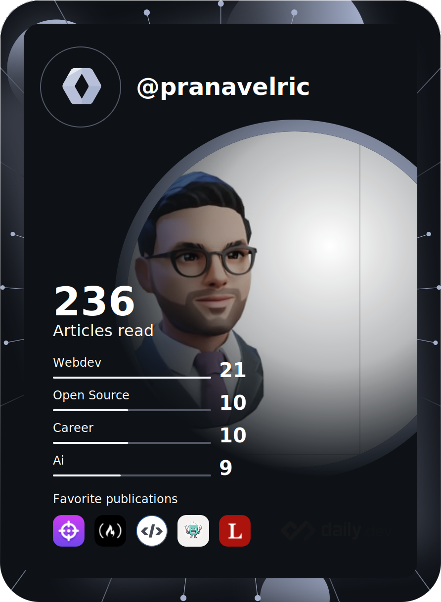
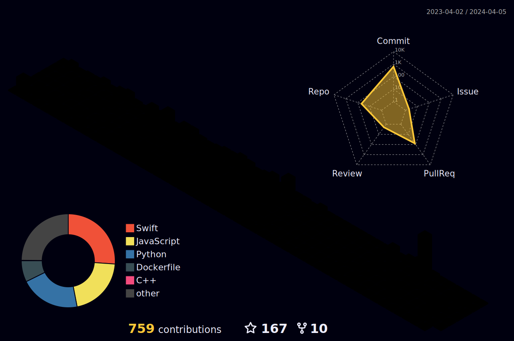

 

  

   

 
 

 
 
   

### 🧐 More About Me:

- 💬  I dabble in Android, Kotlin, Java, Flutter, Django and spend most of my time automating my life via literally living inside the terminal 🤷🏻‍♂️
- 😄  I also Love to Watch Anime in my free time and have a keen interest in Japan and Japanese Culture.
- 📫  Reach me [at] pranavchoudhary500@gmail.com
- 💡  [Learn more about me](https://pranavelric.github.io/)
- 💬  &nbsp; Ask me about anything tech related, I am happy to help;
- 📫  &nbsp; Feel free to ping me on [LinkedIn](https://www.linkedin.com/in/pranav-choudhary/)
- ⚡  Fun fact: I keep night shift switched on at all times

  
- 

 
 
 
 
 

<!-- ###  Hobbies :

- ✨ Watching Anime
- ✨ Cooking
- ✨ Drawing -->

###

  
   •   
  <!--  • -->
   •
   

##
<!-- Trophy -->

  

 

<!-- Github streak -->

  
  
  

#

 

  
 
 

 
 
 
 

#

  

###

  
## 𝙻𝙰𝙽𝙶𝚄𝙰𝙶𝙴𝚂 𝙰𝙽𝙳 𝚃𝙾𝙾𝙻𝚂:  

<!-- backend -->

 
 
  

  
 

  

 
 <!-- devops and mob apps -->
###

<code></code>  
<code></code>  
<code></code>  
<code></code>  
<code></code>  
<code></code>  
<code></code>
<code></code>  
<code></code>  
<code></code>  
<code></code> 
<code></code>  

<!-- frontend -->
###

<code></code>    
<code>  </code>  
<code>  </code>  
<code>  </code>  
<code>  </code>  
<code>  </code>  
<code>  </code>   
<code>  </code>  
<code> </code>  

  
 

 

  
<b>📊 Github Stats</b>

 
 
 

#

    
  <h4 align="center"><code>📊 𝙶𝚒𝚝𝙷𝚞𝚋 𝙼𝚎𝚝𝚛𝚒𝚌𝚜</code></h4>

 

## 😂 Here is a random joke that'll make you laugh!
  

<h1>
  Connect With Me
  
</h1>

   
  <a href="https://www.linkedin.com/in/pranav-choudhary/" target="_blank">
    <code></code>
  </a>
  <a href="https://stackoverflow.com/users/10224590/pranav-choudhary/" target="_blank">
    <code></code>
  </a>
  <a href="https://www.instagram.com/pranav.elric" target="_blank">
    <code></code>
  </a>
  <a href="https://dev.to/pranavelric" target="_blank">
    <code></code>
  </a>
  <a href="mailto:pranavchoudhary500@gmail.com">
    <code></code>
  </a>     

 
 

### 𝚂𝚑𝚘𝚠 𝚜𝚘𝚖𝚎 ❤️ 𝚋𝚢 𝚜𝚝𝚊𝚛𝚛𝚒𝚗𝚐 𝚜𝚘𝚖𝚎 𝚘𝚏 𝚝𝚑𝚎 𝚛𝚎𝚙𝚘𝚜𝚒𝚝𝚘𝚛𝚒𝚎𝚜!

#

