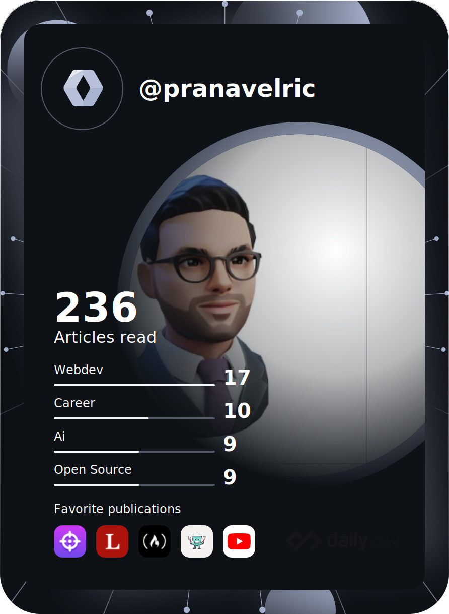
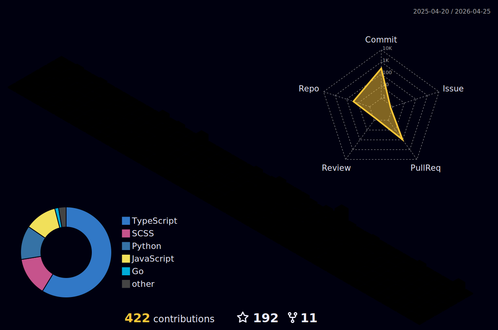

  

<h1 align="center">👋 Welcome to My GitHub Profile!</h1>

  
  
  
  
  

  
   •
   •
  

---

## 🚀 About Me

  

- 💻 I'm a **full stack developer** crafting solutions across mobile, backend, and frontend technologies. I'm passionate about automation — practically living inside the terminal.

- 🚀 Beyond code, I'm driven by continuous learning and exploring emerging technologies. When I'm not coding, you'll find me diving into anime, exploring Japanese culture, or planning my next adventure.

- 📧 **Let's connect!** Reach out at [pranavchoudhary500@gmail.com](mailto:pranavchoudhary500@gmail.com) or check out my [portfolio](https://pranavelric.github.io/).

- ⚡ **Fun fact:** I keep night shift mode on 24/7!

 

  

---

## 📊 GitHub Statistics

  
  

 

  

 

  

 

  
  
  

---

## 🛠️ Technologies & Tools

<table style="border:none">
  <tr>
    <td align="center" width="40%" style="border:none">
      
    </td>
    <td width="60%" style="border:none">
      
  #### Backend & Databases
  

  #### DevOps & Cloud
  

  #### Mobile Development
  

  #### Frontend & Design
  

  </td>
  </tr>
</table>

 ---

## 🌟 Activity & Contributions

  

---

## 🎭 Developer Humor

  

---

## 🌈 Contribution Visualizations

  

 

<picture>
  <source media="(prefers-color-scheme: dark)" srcset="https://raw.githubusercontent.com/pranavelric/pranavelric/main/images/github-contribution-grid-snake-dark.svg">
  <source media="(prefers-color-scheme: light)" srcset="https://raw.githubusercontent.com/pranavelric/pranavelric/main/images/github-contribution-grid-snake.svg">
  
</picture>

---

## 📊 Detailed GitHub Metrics

  

---

## 🤝 Connect With Me

   
  
  
  
  
       

 

---

  
  
    
  
  

    <b>⭐ If you find my projects interesting, consider giving them a star!</b>
  

    
  

    © 2025 Pranav Choudhary. Licensed under MIT.
  

