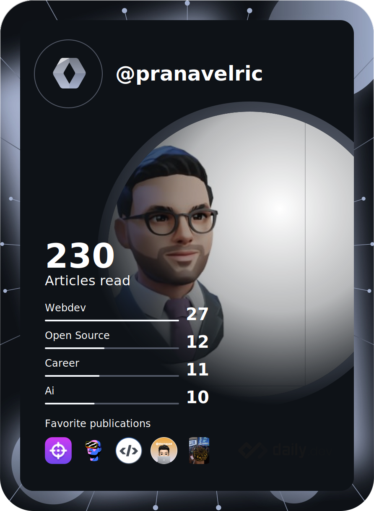
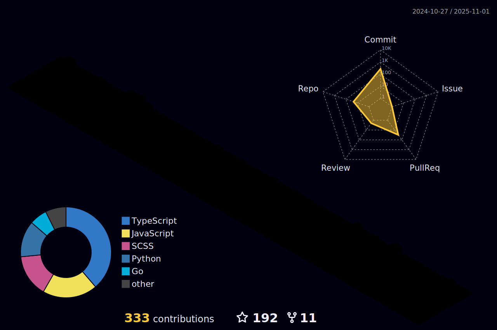

  

  
  
  
  
  

###

  
   •
   •
  

---

## 🧐 More About Me

  

- 💬  I dabble in **Android**, **Kotlin**, **Java**, **Flutter**, **Django** and spend most of my time automating my life practically living inside the terminal 🤷🏻‍♂️.
- 😄 In my free time, I enjoy watching **anime** and exploring **Japanese culture**.
- 📫 Reach me at: **pranavchoudhary500@gmail.com**.
- 💡 Learn more about me on my [portfolio](https://pranavelric.github.io/).
- ⚡ **Fun fact**: I keep night shift mode on 24/7!

  

---

## 📊 GitHub Stats

 

#

 
#

  

##

  
  
  

---

## 🛠️ Languages and Tools

<!-- backend -->
 

 
 
  

  
 

  

 
 <!-- devops and mob apps -->
###

 

<!-- frontend -->
###

  
   
   
  
  
  
  
  
 

 

 

## 🌟 Activity & Contributions

  

---

## 😂 Random Joke

  

---

<picture>
  <source media="(prefers-color-scheme: dark)" srcset="https://raw.githubusercontent.com/pranavelric/pranavelric/main/github-contribution-grid-snake-dark.svg">
  <source media="(prefers-color-scheme: light)" srcset="https://raw.githubusercontent.com/pranavelric/pranavelric/main/github-contribution-grid-snake.svg">
  
</picture>

---

## 📊 𝙶𝚒𝚝𝙷𝚞𝚋 𝙼𝚎𝚝𝚛𝚒𝚌𝚜

 

## 📬 Connect With Me

 

   
  <a href="https://www.linkedin.com/in/pranav-choudhary/" target="_blank">
    <code></code>
  </a>
  <a href="https://stackoverflow.com/users/10224590/pranav-choudhary/" target="_blank">
    <code></code>
  </a>
  <a href="https://www.instagram.com/pranav.elric" target="_blank">
    <code></code>
  </a>
  <a href="https://dev.to/pranavelric" target="_blank">
    <code></code>
  </a>
  <a href="mailto:pranavchoudhary500@gmail.com">
    <code></code>
  </a>     

 
 

  <h3>Show some ❤️ by starring my repositories!</h3>

---

  

