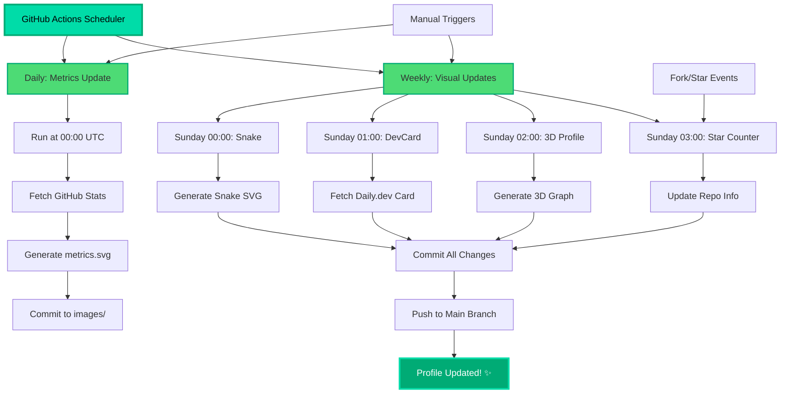

# GitHub Profile Automation Workflows

This document provides comprehensive documentation for all automated workflows that keep this GitHub profile up-to-date.

## Overview

This profile uses **5 GitHub Actions workflows** to automatically generate and update various visual elements:

1. **GitHub Metrics** - Comprehensive statistics and insights
2. **Contribution Snake** - Animated contribution graph
3. **3D Contribution Graph** - 3D visualization of contributions
4. **DevCard** - Daily.dev developer card
5. **Star/Fork Counter** - Repository statistics updater

## Workflow Schedule

All workflows are optimized to minimize API rate limits and resource usage:

| Workflow | Schedule | Trigger | Output Location |
|----------|----------|---------|-----------------|
| Metrics | Daily at 00:00 UTC | Cron + Manual | `images/github-metrics.svg` |
| Snake | Weekly (Sun 00:00 UTC) | Cron + Manual | `images/github-contribution-grid-snake*.svg` |
| DevCard | Weekly (Sun 01:00 UTC) | Cron + Manual | `images/devcard.svg` |
| 3D Profile | Weekly (Sun 02:00 UTC) | Cron + Manual | `images/profile-3d-contrib/*.svg` |
| Fork/Star | Weekly (Sun 03:00 UTC) + Events | Cron + Fork + Star + Manual | Repository description |

## Workflow Details

### 1. GitHub Metrics (`metrics.yml`)

**Purpose**: Generates comprehensive GitHub statistics including achievements, languages, habits, and more.

**Schedule**: Daily at 00:00 UTC

**Manual Trigger**: Yes (workflow_dispatch)

**Plugins Enabled**:
- Achievements (detailed display)
- Follow-up statistics
- Introduction card
- ISO calendar (full year)
- Languages analysis
- Notable contributions
- People interactions
- Stack Overflow integration
- Starred repositories
- Coding habits
- Stargazers
- Topics
- Traffic analytics
- Reactions
- PageSpeed insights
- Fortune messages
- Support information

**Required Secrets**:
- `METRICS_TOKEN`: GitHub Personal Access Token with appropriate permissions
- `PAGESPEED_TOKEN`: Google PageSpeed API token (optional but recommended)

### 2. Contribution Snake (`snake.yml`)

**Purpose**: Creates an animated snake that "eats" GitHub contributions.

**Schedule**: Weekly on Sundays at 00:00 UTC

**Manual Trigger**: Yes (workflow_dispatch)

**Outputs**:
- Light theme: `images/github-contribution-grid-snake.svg`
- Dark theme: `images/github-contribution-grid-snake-dark.svg`

**Required Secrets**:
- `METRICS_TOKEN`: GitHub token for pushing updates

**Features**:
- Automatically adapts to light/dark color schemes using `<picture>` element
- SVG-only output for fast loading
- Weekly updates to reduce API usage

### 3. DevCard (`Devcard.yml`)

**Purpose**: Generates a developer card from Daily.dev showcasing reading preferences and stats.

**Schedule**: Weekly on Sundays at 01:00 UTC

**Manual Trigger**: Yes (workflow_dispatch)

**Output**: `images/devcard.svg`

**Required Secrets**:
- `DEVCARD_ID`: Daily.dev developer card ID

**Setup**:
1. Create account at [daily.dev](https://daily.dev)
2. Get your DevCard ID from your profile settings
3. Add as repository secret

### 4. 3D Contribution Profile (`profile-3d.yml`)

**Purpose**: Creates 3D visualizations of GitHub contribution graphs.

**Schedule**: Weekly on Sundays at 02:00 UTC

**Manual Trigger**: Yes (workflow_dispatch)

**Outputs**: Multiple SVG files in `images/profile-3d-contrib/`:
- `profile-green.svg`
- `profile-green-animate.svg`
- `profile-season.svg`
- `profile-season-animate.svg`
- `profile-night-green.svg`
- `profile-night-rainbow.svg` (featured in README)
- `profile-night-view.svg`
- `profile-gitblock.svg`
- And more...

**Required Secrets**:
- `METRICS_TOKEN`: GitHub token for API access and pushing updates

**Configuration**:
- `MAX_REPOS: 250` - Analyzes up to 250 repositories

### 5. Fork/Star Counter (`fork_start.yml`)

**Purpose**: Updates repository description with current star and fork counts.

**Schedule**: 
- Weekly on Sundays at 03:00 UTC
- On fork events
- On star events

**Manual Trigger**: Yes (workflow_dispatch)

**Template**: "PranavElric's profile with \<starCount\> stars ⭐ and \<forkCount\> forks 🎉."

**Required Secrets**:
- `METRICS_TOKEN`: GitHub token with repo permissions

## Rate Limit Optimization

To avoid GitHub API rate limits, workflows are strategically scheduled:

1. **Staggered execution**: Different start times (00:00, 01:00, 02:00, 03:00 UTC)
2. **Reduced frequency**: Most run weekly instead of daily
3. **Manual triggers**: All workflows can be triggered manually when needed
4. **Efficient queries**: Limited repository analysis (MAX_REPOS: 250)

## Manual Workflow Execution

To manually trigger any workflow:

1. Go to **Actions** tab in the repository
2. Select the workflow from the left sidebar
3. Click **Run workflow** button
4. Select branch (usually `main`)
5. Click **Run workflow**

## Secrets Configuration

Required secrets (Settings → Secrets → Actions):

| Secret Name | Purpose | How to Get |
|-------------|---------|------------|
| `METRICS_TOKEN` | GitHub API access | Create [Personal Access Token](https://github.com/settings/tokens) with `repo`, `read:org`, `read:user`, `read:packages` scopes |
| `DEVCARD_ID` | Daily.dev integration | Get from [Daily.dev DevCard settings](https://app.daily.dev/devcard) |
| `PAGESPEED_TOKEN` | PageSpeed insights | Get from [Google Cloud Console](https://console.cloud.google.com/) |

## Troubleshooting

### Workflow Fails

1. **Check API rate limits**: Go to Settings → Actions → ensure workflows aren't hitting limits
2. **Verify secrets**: Ensure all required secrets are set correctly
3. **Check token permissions**: Tokens need appropriate scopes
4. **Review logs**: Click on failed workflow run to see detailed logs

### Outdated Content

1. **Manual trigger**: Run the specific workflow manually
2. **Check schedule**: Verify cron expressions are correct
3. **Verify permissions**: Ensure `contents: write` permission is set

### Images Not Updating

1. **Clear browser cache**: Hard refresh (Ctrl+F5 or Cmd+Shift+R)
2. **Check file paths**: Ensure paths in README match workflow outputs
3. **Verify commits**: Check if workflow committed changes to repository

## Automation Architecture

## Best Practices

1. **Don't over-trigger**: Weekly updates are sufficient for most visuals
2. **Monitor rate limits**: Check Actions usage in repository settings
3. **Keep tokens secure**: Never commit tokens to repository
4. **Regular maintenance**: Update action versions when new releases are available
5. **Test changes**: Use manual triggers to test workflow modifications

## Maintenance Schedule

- **Monthly**: Review action versions for updates
- **Quarterly**: Check token expiration and renew if needed
- **Annually**: Review and optimize workflow configurations

## Resources

- [GitHub Actions Documentation](https://docs.github.com/en/actions)
- [Metrics Action](https://github.com/lowlighter/metrics)
- [Snake Action](https://github.com/Platane/snk)
- [3D Contrib Action](https://github.com/yoshi389111/github-profile-3d-contrib)
- [DevCard Action](https://github.com/dailydotdev/action-devcard)
- [Cron Expression Guide](https://crontab.guru/)

## Contributing

To improve these workflows:

1. Fork the repository
2. Create a feature branch
3. Test changes with manual triggers
4. Submit a pull request with detailed description

---

**Last Updated**: 2025-12-14

**Maintained By**: Pranav Choudhary ([@pranavelric](https://github.com/pranavelric))
